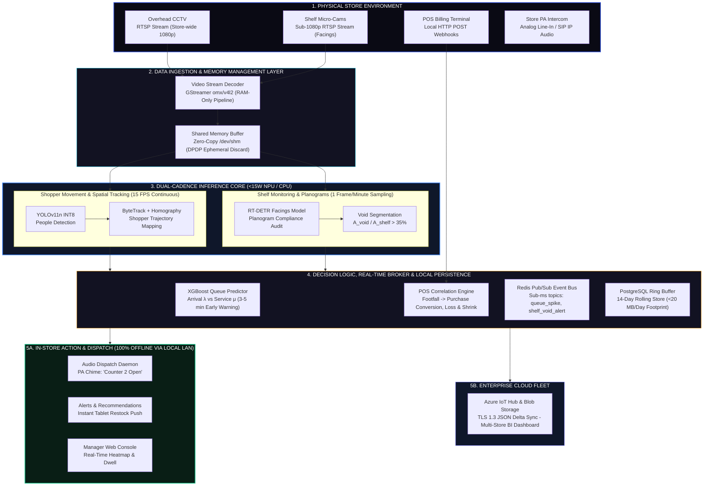

# PARALLAX — Centralized Edge Analytics & Real-Time Store Operations Dashboard

<div align="center">


**Centralized Edge Analytics & Real-Time Store Operations Dashboard | Smart India Hackathon 2026 (PS ID: 26179)**

[**Explore Live Demo**](https://dkarthikraj.github.io/Parallax-Retail-Dashboard/) • [**Architecture Deep-Dive**](#system-architecture--technical-approach) • [**Getting Started**](#getting-started)

</div>

---

## Executive Overview & Proposed Solution

**PARALLAX** is a next-generation on-device retail intelligence platform engineered for **Smart India Hackathon (SIH) 2026 (Problem Statement ID: 26179)**. Built to operate natively on low-power edge hardware (Qualcomm RB3 Gen 2 / Raspberry Pi 5 with NPU), PARALLAX processes multi-camera computer vision feeds directly at the store edge without transmitting raw video streams to external cloud servers.

### Key Capabilities & Engineering Highlights

- **Edge AI Retail Intelligence Platform**: Executes on-device AI inference on low-power edge hardware (<15W) to monitor store operations in real time without cloud bandwidth overhead.
- **Modular Camera Integration**: Ingests standard RTSP streams from existing overhead CCTVs while supporting modular shelf-facing micro-cameras for deep hypermarket racks, operating reliably across diverse retail formats.
- **Shopper Analytics & Dwell Mapping**: Tracks customer traffic patterns and entering/exiting footfall via virtual tripwires, measuring shopper dwell time across store zones using 2D floorplan homography without facial recognition.
- **Shelf-Void & Inventory Monitoring**: Uses binary surface segmentation ($A_{void} / A_{shelf} > 35\%$) to detect out-of-stock products and monitor planogram compliance without needing to train on thousands of shifting FMCG brand logos.
- **Proactive Queue Intelligence**: Tracks checkout counters and predicts queue congestion using arrival velocity ($\lambda$) versus service rate ($\mu$) to recommend opening additional billing counters before lines become excessive.
- **Vision-to-POS Discrepancy Engine**: Correlates shopper dwell time directly with register transaction logs to surface phantom stockouts, pricing friction, and checkout scanning shrinkage.
- **Dual-Cadence Edge Scheduling**: Runs high-velocity movement at 15 FPS while sampling shelves once per minute, enabling rapid, low-latency decisions while cutting compute load and thermal throttling by 70%.
- **Strict DPDP Privacy & Offline Survivability**: Decodes video in volatile RAM with zero facial/biometric storage for **DPDP Act 2023 compliance**, buffering telemetry in local PostgreSQL/Redis ring buffers for uninterrupted operation during connectivity outages.

---

## End-to-End Retail Intelligence Workflow

| Step | Shopper Journey | Data Capture & Edge AI | Store Actions & Insights |
| :--- | :--- | :--- | :--- |
| **1. Store Entry** | Customer walks into the store | **Entry/Exit CCTV**: Anonymous YOLOv11n detection (No PII) | **Footfall Analytics**: Entry/Exit counts, time/day trends & zone analytics |
| **2. Aisle Browsing** | Navigates aisles & promo displays | **Ceiling Aisle Cameras**: OpenCV 2D floor homography & tracking | **Customer Journey Heatmaps**: Zone Dwell Time & Promo Impact |
| **3. Shelf Interaction** | Browses and picks inventory items | **Shelf Micro-Cameras**: RT-DETR planogram compliance & void checks | **Inventory Replenishment**: Low-stock, out-of-stock & availability alerts |
| **4. Checkout Queue** | Joins line at billing counter | **Checkout Cameras**: XGBoost queue model (Arrival vs Billing rate) | **Queue Intelligence**: Real-time congestion alerts & cashier call |
| **5. Billing & Payment** | Items scanned & payment settled | **POS Webhook Connector**: Matches checkout scan events to zone dwell | **Store KPI Dashboard**: Footfall, conversion, inventory & queue KPIs |
| **6. Store Exit** | Leaves store; session concludes | **Exit Traffic Tracking**: Detects & counts customer exits by time & zone | **Aggregated Store Insights**: Daily & weekly reports on trends & staff efficiency |

---

## System Architecture & Technical Approach



### Technical Implementation Stack

| Component | Technology | Technical Specification |
| :--- | :--- | :--- |
| **Edge Hardware Unit** | Qualcomm RB3 Gen 2 (QCS6490) / RPi 5 + Hailo-8L | Sub-15W power envelope, 13 TOPS AI acceleration |
| **Stream Ingestion** | GStreamer (v4l2 / omx) | RTSP/ONVIF hardware-accelerated decoding into volatile RAM |
| **Shopper Tracking Engine** | YOLOv11-Nano (INT8) + ByteTrack | Non-biometric centroid kinematics for DPDP Act compliance |
| **Spatial Dwell & Projection** | OpenCV Homography Matrix | 2D camera-to-floorplan pixel transformation |
| **Shelf Monitoring** | RT-DETR / YOLO Facing Model | Binary surface void segmentation ($A_{void} / A_{shelf} > 35\%$) |
| **Predictive Queue Analytics** | XGBoost Regression | Queue arrival rate ($\lambda$) vs cashier service rate ($\mu$) |
| **Local Persistence & Caching**| PostgreSQL + Redis | 14-day rolling ring buffer (<20 MB/day RAM footprint) |
| **In-Store Dispatch** | WebSockets + SIP Audio Daemon | Sub-ms tablet notifications & automated PA intercom chimes |
| **Enterprise Fleet Telemetry** | Azure IoT Hub over MQTT/TLS | Lightweight JSON delta sync for multi-store BI reporting |

---

## Feasibility and Viability

### Modular Deployment Model

| Store Format | Hardware Required | Operational Scope |
| :--- | :--- | :--- |
| **Kirana / Small Stores** | 1–2 Existing Ceiling CCTVs + Single Edge Box | Peak-hour footfall profiling, billing bottleneck forecasting, counter-dwell & shrinkage monitoring |
| **Supermarkets & Pharmacies** | Existing CCTV + Shelf Micro-Cameras + POS Sync | Aisle dwell heatmaps, shelf out-of-stock alerts, predictive queue chimes |
| **Hypermarket Chains** | Multi-Edge Hub + Central Cloud Dashboard | Automated restock ticketing, shrinkage audits, multi-store fleet benchmarking |

### Key Challenges & Engineered Mitigations

| Potential Challenge | Engineered Mitigation Strategy |
| :--- | :--- |
| **Internet & Power Drops in Tier-2/3 Stores** | **100% Offline Autonomy**: On-premise PostgreSQL & Redis buffer 14 days of telemetry; audio chimes and staff alerts run uninterrupted on local LAN. |
| **Low-Quality Grainy CCTV in Older Stores** | **Pre-Processing Pipeline**: GStreamer CLAHE contrast normalization; robust INT8 models optimized for low-resolution 480p streams. |
| **Lack of Fixed Planograms in Small Retail** | **Surface Geometry Engine**: Evaluates relative shelf void area ratio ($A_{void} / A_{shelf} > 35\%$) and slot spacing rather than rigid SKU templates. |
| **Dense Crowds & False Queue Spikes** | **Kinematic Filtering**: ByteTrack directional vectors + XGBoost regression filter out passing/browsing shoppers from active billing lines. |
| **Edge Hardware Thermal Throttling** | **Dual-Cadence Scheduling**: Active queues processed at 15 FPS while static shelves sample at 1 FPM, cutting compute load and heat by 70%. |

---

## Impact and Multi-Dimensional Benefits

### Audience Impact

- **Store Cashiers & Floor Staff**: Automated multilingual audio alerts open counters before lines build. Direct tablet restock dispatch routes staff straight to empty shelf bays.
- **Store Managers & Regional Chains**: Live footfall-to-conversion analytics without manual video audits. Full store operational payback and ROI delivered within 4 to 6 months.
- **Neighbourhood Kirana Stores**: Enterprise-grade intelligence running on existing CCTV; zero infrastructure overhaul. Operates seamlessly on standard store inverter/UPS backups (<15W).
- **End Shoppers & Consumers**: Reduced checkout wait times and consistent on-shelf product availability. 100% Privacy-by-Design with ephemeral RAM processing (no facial recognition).

### Multi-Dimensional Benefits

- **Economic Value**: Prevents stockout revenue loss, cuts queue dropouts, and optimizes merchandising via dwell heatmaps.
- **Operational Efficiency**: Minimizes cloud bandwidth via edge AI while ensuring 100% alerting continuity during internet drops.
- **Scalable Fleet Deployment**: Scales seamlessly from standalone kiranas to multi-store retail chains with centralized cloud telemetry.
- **Privacy & Legal Alignment**: Aligns with DPDP Act 2023 principles using volatile RAM frame processing and strictly non-biometric tracking.
- **Environmental Sustainability**: Operates on <15W edge hardware, drastically slashing carbon footprints versus 24/7 cloud GPU streaming.

### Future Expansion

Expand beyond store analytics by integrating **smart carts** alongside **real-time virtual baskets** for instant cashless checkout, with optional **RFID tags** and **weight-sensing shelves** on demand.

---

## Getting Started

### Local Setup & Execution

1. **Clone the Repository**:
   ```bash
   git clone https://github.com/dkarthikraj/Parallax-Retail-Dashboard.git
   cd Parallax-Retail-Dashboard
   ```

2. **Run Dashboard Locally**:
   Open `index.html` directly in any web browser, or launch using a local HTTP server:
   ```bash
   npx serve .
   ```

3. **Access Command Center**:
   Navigate to `http://localhost:3000` or open `index.html`.

---

## Deployment

This repository is configured for automatic deployment via **GitHub Pages**:

- **Live GitHub Pages URL**: `https://dkarthikraj.github.io/Parallax-Retail-Dashboard/`

---

## License

This project is licensed under the [MIT License](LICENSE).


